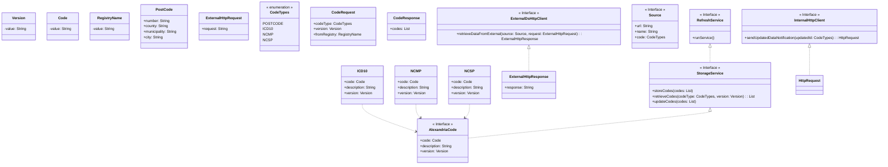
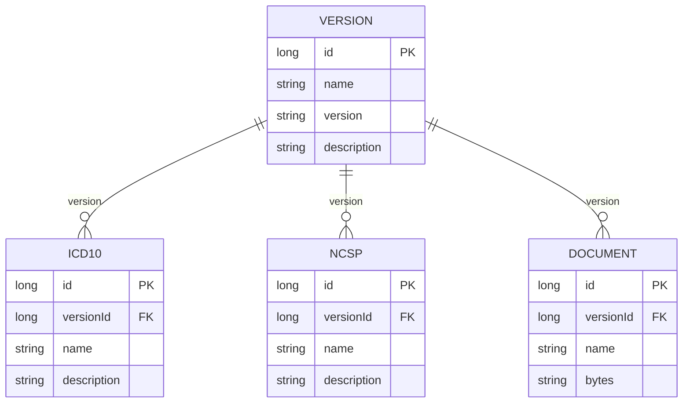

```mermaid
classDiagram 
class Version {
    -value: String
}
class Code {
    -value: String
}
class RegistryName {
    -value: String
}
class AlexandriaCode {
    << Interface >>
    +code: Code
    +description: String
    +version: Version
}
class PostCode {
    +number: String
    +county: String
    +municipality: String
    +city: String
}
class ICD10 {
    +code: Code
    +description: String
    +version: Version
}
class NCMP {
    +code: Code
    +description: String
    +version: Version
}
class NCSP {
    +code: Code
    +description: String
    +version: Version
}
class ExternalHttpRequest {
    +request: String
}
class ExternalHttpResponse {
    +response: String
}
class CodeTypes {
    << enumeration >>
    POSTCODE
    ICD10
    NCMP
    NCSP
}
class CodeRequest {
    +codeType: CodeTypes
    +version: Version
    +fromRegistry: RegistryName
}
class CodeResponse {
    +codes: List<AlexandriaCode>
}
class InternalHttpClient {
    << Interface >>
    +sendUpdatedDataNotification(updatedId: CodeTypes): HttpRequest
}
class Source {
    << Interface >>
    +url: String
    +name: String
    +code: CodeTypes
}
class ExternalDsHttpClient {
    << Interface >>
    +retrieveDataFromExternal(source: Source, request: ExternalHttpRequest): ExternalHttpResponse
}
class StorageService {
    << Interface >>
    +storeCodes(codes: List<AlexandriaCode>)
    +retrieveCodes(codeType: CodeTypes, version: Version): List<AlexandriaCode>
    +updateCodes(codes: List<AlexandriaCode>)
}
class RefreshService {
    << Interface >>
    +runService()
}
ICD10 ..> AlexandriaCode
NCMP ..> AlexandriaCode
NCSP ..> AlexandriaCode
InternalHttpClient <|.. HttpRequest
ExternalDsHttpClient <|.. ExternalHttpResponse
StorageService <|.. AlexandriaCode
RefreshService <|.. StorageService
```

```mermaid
erDiagram
    VERSION ||--o{ ICD10 : version
     VERSION ||--o{ NCSP : version
    VERSION ||--o{ DOCUMENT: version
    VERSION {
        long id PK
        string name
        string version
        string description
    }
    
    ICD10 {
        long id PK
        long versionId FK
        string name
        string description
    }

    NCSP {
        long id PK
        long versionId FK
        string name
        string description
    }
    DOCUMENT {
        long id PK 
        long versionId FK
        string name
        string bytes
    }
 
```