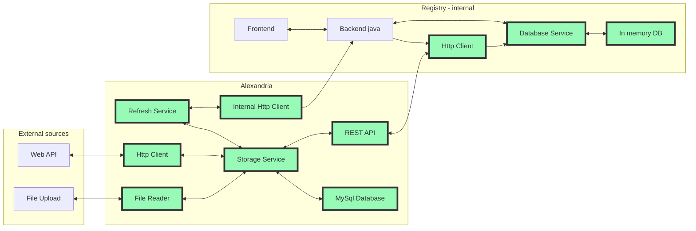
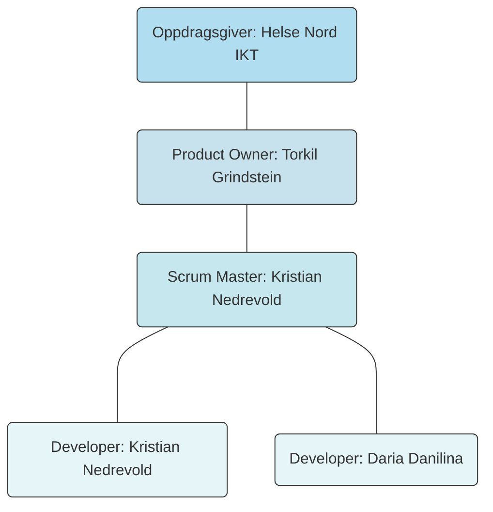

# Bachelorppgave 2023 - Forprosjekt

## Introduksjon

Helse Nord IKT er et eget foretak under Helse Nord paraplyen som i hovedsak leverer tjenester til andre foretak i Helse Nord.
Seksjon for systemutvikling i avdeling for Tjenesteutvikling er delt opp i ulike team. 

### Kvalitetsregister
Denne oppgaven er på bestilling fra team
for kvalitetsregister. Helse Nord IKT er en av to godkjente leverandører av nasjonale medisinske kvalitetsregister. Teamet jobber
med å utvikle platform for kvalitetsregister samt de spesfikke register.

Et medisinsk kvalitetsregister er en registreringsløsning for medisinske data relatert til et spesifikt fagfelt, der data samles
 inn for å brukes til forskning. Et eksempel på et slikt register er Norsk Gynekologisk Endoskopi Register(NGER). 

Registeret samler inn data om:

* Konvertering til laparoskopi (ut fra hysteroskopi)/ laparotomi (ut fra hysteroskopi, laparoskopi)
* Intraoperative komplikasjoner
* Postoperative komplikasjoner
* Reoperasjon for komplikasjoner innen 4 uker
* pasientens helsegevinst og 
* tilfredshet med behandlende enhet

[ref]https://www.kvalitetsregistre.no/register/gynekologi/norsk-gynekologisk-endoskopiregister

Ved å samle inn data fra alle pasienter som blir endoskopisk operert for gynekologiske tilstander og sykdommer ved offentlige og private
sykehus er det da mulig å utføre statistike analyser for å identifisere positive og negative aspekter ved det enkelte behandlignssted og
på tvers av behandlingssted. 

[ref]https://www.kvalitetsregistre.no/register/gynekologi/norsk-gynekologisk-endoskopiregister

På denne måten er nasjonale kvalitetsregister et viktig verktøy for å sikre lik og trygg behandling for alle pasienter uavhengig av geografisk
tilhørlighet.

### 1.1 Bakgrunn for oppgaven

For registering av medisinske kvalitetsparamtre brukes det diverse oppslagsverk. Kodeverk som brukes er [Skriv ned alle]. I tillegg kreves det
oppdatert informasjom om opplysninger som norske postnummer, kommuner, fylker osv [fyll på mer her]. Dette er i dag opplysninger som er hardkodet
inn i applikasjonen, skal de oppdateres trenger de enten en "redeploy" eller kjøring av SQL script i produksjonsmiljøet. Dette er en prosess som 
må gjentas for alle kvalitetsregistre. Det er heller ingen automatikk i oppdatering av koder, det skjer enten når utvikler oppdager utdaterte koder
eller når kunde ber om oppdaterte koder.

Det er derfor ønskelig med en felles tjeneste som kan hente inn koder fra ulike kilder(API, filer osv.) sammenfatte og versjonsstyre kodene. For
så å levere de til register applikasjonene via et REST API. Det er altså ønskelig automatisere oppdaterings prosessen i størs mulig grad, 
og på denne måten kunne tilby mest mulig oppdatert data.

Det er da også naturlig at det implementeres en klient til APIet i registrenes felles kode. Da er det naturlig å tenke at 
koder ikke lengre lagres i SQL databasen, men heller i en type in-memory database for raskere oppslag i applikasjonen. 
In-memory databasen settes opp slik at den oppdateres hver gang det kommer nye koder i REST APIet. 

Det er også uttrykt et ønske om mulighet for laste versjonerte dokumenter inn i applikasjonen som kan lagres som binary
blobs. De skal også tilgjengeliggjøres via APIet. Dette ønskes da hvert kvalitetsregister lagrer og tilgjengeligjør et antall
dokumenter for ulike formål. Det lagres også maler for meldinger som skal sendes til inbyggere. Det er da ønskelig å ha en
felles portal for å oppdatere og tilgjengeligjøre disse dokumentene. 

### 1.2 Prosjektbeskrivelse og analyse
Utviklingen vil foregå i to ulike kodebaser. Selve tjenesten som skal hente data fra eksterne kilder og i den eksisterende register koden der HTTP klient og in-memory database skal etableres.

**Alexandria:**
Applikasjonen vi skal utvikle har fått navnet Alexandria etter det store biblioteket i Alexandria i Egypt.

 **Eksisterende backend:**

 1. HTTP Klient som skal hente oppdaterte data fra Alexandria etter mottak om oppdaterte data
 2. Storage service som lagrer og henter data fra in-memory database
 3. In-memory database


### Dataflyt i applikasjonen
Grønne ruter skal implementeres som en den av prosjektet.

Fig 1. Dataflyt i applikasjonen. Generert med mermaid


**Teknologier:**

Kvalitetsregister teamet bruker JVM teknologier for sin utvikling, da spesifikt Java og Kotlin, der hovedkodebasen
er en monolitt skrevet i Java som tar i bruk mange ulike teknologier. Ny kode skrives som regel i Kotlin. Tjenester
som er ekstern til monolitten skrives i Kotlin. Med dette tatt i betraktning skal også denne tjenesten skrives i
Kotlin. Alle nye tjenester kjører i kontainermiljø, der produksjonsmiljøet er driftet av Norsk Helse Nett(NHN). 
Hele kvalitetsregisterplatformen til HN-IKT er i en migreringsprosess der den skal over i Kubernetes. Det er derfor
viktig at applikasjonen utvikles slik at den enkelt kan kjøre i et slik miljø.

Hovedteknologier som skal brukes for tjenesten
* Kotlin
* Ktor web server og http klient rammeverk
* R2DBC for databasetilgang
* Gradle som byggverktøy
* Docker og docker-compose for kontainer kjøremiljø og oppsett
* MySql database

### 1.4 Rammebetingelser
Utvikling kan skje fra egen PC. Anbefalt å bruke IntelliJ IDEA for utvikling av Kotlin kode. Team for kvalitetsregister må 
tilgjengeligjøre kildekode for utvikling av komponenter som er intern i register koden, eventuelt veilede i hvordan et
eksternt lib kan opprettes slik det kan føyes inn i applikaskjonen. 

## Brukere, brukermiljø og behov.

### 2.1 Brukere

Teknisk bruker av applikasjonen er da team for kvalitetsregister ved HN-IKT. 
 
Sluttbrukerene er her følgende kvalitetsregister:
 * Norsk gynekologisk endoskopiregister
 * Norsk register for invasiv kardiologi
 * Norsk kvalitetsregister for behandling av spiseforstyrrelser
 * Norsk register for arvelige og medfødte nevromuskulære sykdommer
 * Register for Hidradenitis supprativa
 * Norsk register for analinkontinens
 * Norsk register for gastrokirurgi
 * Norsk kvalitetsregister for endokarditt
 * Nasjonalt kvalitetsregister for ryggkirurgi

### 2.2 Brukermiljø

Applikasjonen blir en intern del av kvalitetsregister mikrotjeneste platformen, da den i hovedsak erstatter det som i dag er
en tungvindt og manuell prosess. Dette vil igjen påvirkere brukerene av kvalitetsregistrene som vil oppleve at kvalitetsregistrene
 stadig er oppdatert med nyeste versjoner av kodeverkene. 

Sluttbrukerene vil ikke oppleve endringer på bakgrunn av dette arbeidet i daglig bruk av registeret. 
Den merkbare forskjellen er at det ikke vil ligge noen forsinkelse fra publisering av ny data til den er tilgjengelig i
register-frontenden. 

### 2.3 Sammendrag av brukerens behov
| Behov | Prioritet | Påvirker | Dagens Løsning | Foreslått løsning |
| ----- | --------- | -------- | -------------- | ----------------- |
| Automatisk datafangst | Høy | Alle brukere | Manuell innhenting | Hente fra eksterne kilder via web API |
| Versjonering | Høy | Alle brukere | Manuelt ved lagring i database | Automatisk ved lagring i database |
| Tilgjengeligjøring av oppdatert data | Høy | Alle brukere | Manuell prosess   | Automatisk ved  innhenting av ny data |
| Mellomlagring i registeret | medium | Alle brukere | Lagres i MySql | Lagre in-memory. f.eks REDIS |
| Tilgjengeligjøring av dokumenter | medium | Alle brukere | Lagres i ressurs mapper | Lagre versjonert i database |

## Produktegenskaper

### 3.1 Produktets funksjonelle egenskaper

 * HTTP Klient som skal hente data fra eksterne kilder der det er mulig
 * Fil leser som skal lese inn filer som inneholder data der datafangst via API ikke var mulig. 
 Skal også kunne lese inn filer som lagres i binært format (f.eks PDF filer)
 * Lagrings service som snakker med data inn og data ut tjenestene og lagrer/henter data i en MySql database
 * Database for lagring av innhentet data
 * REST API som serverer data til kvalitetsregister ved forespørsel
 * Refresh service som poller storage service for endringer. Når det er registrert sendes det en melding til
 registeret om at det kan hente ny oppdatert data til sin in-memory database
 * HTTP Klient som sender melding til kvalitetsregisteret om mulighet for oppdatering av data
 * Distribueres som et container image for drift i Docker og Kubernetes miljø

### 3.2 Ikke funksjonelle egenskaper
Det er forventet at produktet er levert med høy kvalitet på kode, høy grad av test dekning, og godt beskrevet
dokumentasjon. Det skal være lett for andre utviklere å videreutvikle produktet. Produktet skal ha et logisk 
konstruert API. Det må vere støtte for måling av metrics via f.eks. Prometheus. 

## 4 Gjennomførbarhetsanalyse 

### 4.1 Tilgjengelige ressurser 

#### 4.1.1 Utstyr 

Alle gruppemedlemmer har en egen PC som kjører Windows, Linux eller macOS. Det kreves ingen spesielt utstyr for gjennomføring av prosjektet.  

#### 4.1.2 Kunnskaper 

For å kunne effektivt planlegge og gjennomføre prosjektarbeid er det ønskelig at studenten har:  

* generelle programmeringskunnskaper 

* kjennskap til objektorientert programmeringsspråk, som Java eller Kotlin 

* kjennskap til systemutvikling 

* kjennskap til utvikling av tjenester etter REST prinsippet 

* kjennskap til kvalitetssikring av programkode ved hjelp av enhetstester 

* kjennskap til bruk av agile utviklingsmetodikker 

* kjennskap til bruk av Jira Software 

* kjennskap til bruk av Git og GitHub 

#### 4.1.3 Litteratur 

Det er planlagt å bruke ulike informasjonskilder slik som bøker, internettkilder, interne dokumenter og rapporter osv. For å kunne finne inspirasjon eller mer elegante løsninger kan det være aktuelt å bruke YouTube, Stackoverflow og informasjon fra forskjellige kurser/plattformer. 


### 4.2 Riskanalyse 

#### 4.2.1 Bakgrunn for risikoanalyse 

I starten av hvert prosjekt er det viktig å vurdere mulige risikoer som kan oppstå underveis. Godt utført risikoanalyse gir prosjektgruppe en bedre oversikt over problemer, som kan oppstå under prosjektgjennomføringen. Dette gir mulighet til å iverksette risikoreduserende tiltak i tide og minimere risikoen for å ikke fullføre prosjektet. [Forelesning.V3.Risikoanalyse] 

Det ble laget en risikotabell som viser en oversikt over mulige uønskede hendelser. Sannsynlighet og konsekvens vurderes for hver enkelt hendelse. Ved hjelp av en enkel formel beregnes det grad av risiko for gjennomføring av prosjektet. Ut fra resultater kan man vurdere behov for iverksetting av risikoreduserende tiltak. [Forelesning.V3.Risikoanalyse]       

Begreper 

Uønsket hendelse er en hendelse som kan føre til tap av verdier.   

Risiko er en kombinasjon av sannsynlighet og konsekvens for en uønsket hendelse.  

Sannsynlighet viser i hvilken grad er det trolig at en bestemt hendelse vil inntreffe.   

Konsekvens viser mulig følge av en bestemt hendelse. 

 [Norsk standard. Krav til risikovurderinger.] 

| Sannsynlighet | Beskrivelse |
| --- | --- | 
| 1 | veldig lite sannsynlig |
| 2 | mindre sannsynlig |
| 3 | sannsynlig |
| 4 | meget sannsynlig |
| 5 | svært sannsynlig |
 
| Konsekvens | Beskrivelse |
| --- | --- |
| 1 | ikke farlig |
| 2 | farlig |
| 3 |kritisk |
| 4 | meget kritisk |
| 5 | katastrofalt |
 
Beregning av risikonivå  

```
Risiko(h) = Sannsynlighet(h) * Konsekvens(h), hvor h - hendelse 
```
[Forelesning.V3.Risikoanalyse] 

4.2.2 Risikoanalyse 

Tabell Risikoanalyse representerer uønskede hendelser, grad av sannsynlighet, grad av konsekvens, beregnet risikonivå og mulige tiltak. [Forelesning.V3.Risikoanalyse]  

  

| Nr. | Beskrivelse av hendelsen | Påvirker | Sannsynlighet | Konsekvens | Risikonivå | Forebyggende tiltak | Korrigerende tiltak |
| --- | ------------------------ | -------- | ------------- | ---------- | ---------- | ------------------- | ------------------- |
| 1   |Prosjektet ble ikke startet innen den gitte tidsrammen |Prosjekt | 2 | 2 | 4 | Oppstartsmøte. Velge kommunikasjonsverktøy. Etablere arbeidsplan og -rutiner. | Ved behov sette litt ekstra tid for å starte å jobbe med prosjektet i tide. |
| 2 | Prosjektet ble ikke fullført innen den gitte tidsrammen | Prosjekt | 3 | 4 | 12 | Aktivt bruk av smidige utviklingsmetoder i løpet av hele prosjektperioden. Ha kontroll over utførelsen av ulike aktiviteter. God kommunikasjon mellom gruppemedlemmer og veiledere. | Ta kontakt med oppdragsgiver og veiledere for å justere arbeidsplan. Diskutere mulighet for gjennomføring av manglende aktiviteter i et annet prosjekt. |
| 3 |  Sykdom eller skade i en gruppe | Person / Prosjekt | 4 | 2 | 8 | Unngå alvorlig sykdom og redusere aktiviteter, som kan føre til skade. | De andre gruppemedlemmer hjelper ved behov |
| 4 | Dobbeltarbeid | Person / Prosjekt | 2 | 2 | 4 | God kommunikasjon mellom gruppemedlemmer. Utarbeide og følge arbeidsplan. Aktivt bruk av Jira Software (Scrum). | Gjøre nødvendige justeringer i arbeidsplanen. Utføre de kritiske aktivitetene. Omprioritering av aktiviteter ved behov. |
| 5 | Dårlig arbeidsmiljø i en gruppe / Konflikter | Person / Prosjekt | 1 | 4 | 4 | Fordeling av roller og ansvarsområder i en gruppe. God kommunikasjon for å forebygge mulige konfliktsituasjoner. | Ved oppstått misforståelse prøve å finne årsaken til dette. Etterpå finne en generell løsning til problemet. For eksempel, gjøre endringer i ansvarsområdet, justere arbeidsmengde osv. |
| 6 | Tap av rapport, kildekode, dokumentasjon ol. | Produkt / Prosjekt | 2 | 5 | 10 | Dokumentasjon og kildekode skal lagres både lokalt hos alle gruppemedlemmer og på de valgte skytjenester som GitHub, Overleaf osv. | Prøve å gjenopprette tapt dokumentasjon og kildekode. Ved behov starte på nytt fra siste checkpoint. 
| 7 | Ønsket funksjonalitet blir ikke implementert | Produkt / Prosjekt | 2 | 4 | 8 | Under planlegging av prosjektarbeid bør gruppe sette realistiske mål over funksjonalitet som skal bli implementert i applikasjonen. | Gjøre endringer i prosjektplanen. Prøve å finne alternative løsninger. Prioritering av oppgaver. |

#### 4.2.3 Risikomatrise  // TODO 

Risiko kan fremstilles ved hjelp av en risikomatrise, der sannsynlighet er plassert langs x – aksen og konsekvens langs y – aksen. Risikomatrise er delt inn i grønt, gul og rødt farge, som representerer risikonivå for en bestemt hendelse i risikotabellen. [https://www.uib.no/hms-portalen/137268/hms-risikovurdering-og-sikker-jobbanalyse-sja#risikomatrise] 


### 4.3 Drøfting og vurdering av ulike løsningsmetoder og analyse av forslag 

#### 4.3.1 Programmeringsverktøy / Utviklingsverktøy 

Det finnes mange forskjellige programmeringsverktøy. Følgende er beskrivelse av teknologier som er aktuelt i vårt prosjekt.  

**Programmeringsspråk**

Kotlin   

Prosjektgruppe har valgt å bruke Kotlin som programmeringsspråk. Grunnen til dette er at applikasjonen skal lages ved hjelp av Ktor rammeverket. Og det er bare Kotlin som kan bli brukt til dette formålet. Dersom prosjektgruppen velger et annet rammeverk, for eksempel Spring Boot, kan Java bli et godt alternativ. 

Kotlin er et moderne programmeringsspråk. Det er forbedret versjon av Java, som er enklere i bruk, raskere å kompilere og inneholder en blanding av funksjonell og objektorientert programmering. Det har også andre fordeler, som clean code, null safety, extension functions, coroutines support osv. [https://www.imaginarycloud.com/blog/kotlin-vs-java/] 

  
**Web rammeverk**

Ktor vs Spring Boot 

Det finnes flere rammeverk som brukes til å skrive applikasjoner i Kotlin. Prosjektgruppe har bestemt seg for å utvikle applikasjonen som REST tjeneste med Ktor rammeverket av JetBrains.   

Ktor er et asynkront mikrorammeverk som egner seg godt til utvikling av små applikasjoner i Kotlin. Både Kotlin, Ktor og IntelliJ IDEA er produkter laget av JetBrains. Dette gir et utmerket verktøystøtte for prosjekter.  Det kreves ikke så mye for å lage Ktor applikasjon, legge til ønsket funksjonalitet, endre konfigurasjon osv. https://ktor.io/idea/ 

Ktor er lett og fleksibelt rammeverk som lar man utvikle og strukturere applikasjonen slik en trenger. Ved behov kan man enkelt utvide applikasjonens funksjonalitet ved hjelp av plugins. https://ktor.io/   

Kotlin er det eneste programmeringsspråk som kan brukes for utvikling av applikasjoner ved hjelp av Ktor rammeverket.   

Spring Boot er fortsatt ledende rammeverk for utvikling av applikasjoner i Java. Den er godt dokumentert og er mye brukt blant utviklere. Dersom prosjektgruppe hadde valgt Java som programmeringsspråk, kunne Spring Boot være et godt alternativ til Ktor.    


**IDE (Integrated Development Environment)**

Prosjektgruppen er godt kjent med IntelliJ IDEA siden den ble mye brukt i løpet av studiet. Samtidig skal applikasjonen utvikles i Kotlin, og oppdragsgiveren prioriterer dette utviklingsmiljø også. Derfor ble den valgt for prosjektet vårt.   

IntelliJ IDEA (Community Edition) er open source IDE, som egner seg best til utvikling av Kotlin applikasjoner. IntelliJ IDEA er utviklet og vedlikeholdt av JetBrains, har flere funksjoner og er godt egnet for rask programvareutvikling. Den har også gode muligheter for integrasjon med andre typer verktøy som Git og GitHub, Gradle og Docker Compose. Siden det er ikke mulig å utvikle Kotlin prosjekter i en annen IDE, finnes det ikke et bedre alternativ til IntelliJ IDEA. [https://www.jetbrains.com/idea/features/] 

 

**Dev/deployment env**

Docker Containere vs Virtual Machines 

Prosjektgruppe har en god erfaring med bruk av Docker og Docker Compose, og derfor ble den valgt for prosjektet vårt.  

Docker er et verktøy som brukes til utvikling, testing og kjøring av applikasjoner i Docker containere. En container inneholder alle nødvendige biblioteker, konfigurasjonsfiler og avhengigheter som kreves for å kunne kjøre applikasjonen. https://cloudacademy.com/blog/docker-vs-virtual-machines-differences-you-should-know/ 

Docker Compose er et verktøy som brukes til å kjøre flere containere samtidig. https://www.kode24.no/artikkel/hva-er-greia-med-docker/74020891 

Det er flere fordeler ved bruk av Docker i programvareutvikling. Docker kan installeres på alle moderne operative systemer, har kort oppstartstid, lav innvirkning på OS og bruker ikke så mye plass på harddisken.  https://www.docker.com/resources/what-container/ 

Docker containere har høy portabilitet og derfor kan bli enkelt flyttet og distribuert mellom ulike maskiner, og med dette forenkler deling av kode. https://circleci.com/blog/containers-vs-virtual-machines/  

Som et alternativ kan man vurdere bruk av virtuelle maskiner. I motsetning til Docker, det er flere ulemper enn fordeler med disse. Virtuelle maskiner har større innvirkning på OS, tregere og tar mye diskplass. https://www.docker.com/resources/what-container/  

Virtuelle maskiner innkapsler en hel maskin, mens Docker Containere innkapsler bare applikasjonen og utviklingsmiljø. Dette gjør deling, ombygning og distribusjon av kode utfordrende. Men virtuelle maskiner har mye bedre sikkerhet enn Docker Containere. https://circleci.com/blog/containers-vs-virtual-machines/  

I enkelte prosjekter kan det være lurt å kombinere bruk av virtuelle maskiner og Docker Containere. https://circleci.com/blog/containers-vs-virtual-machines/   


**Relasjonsdatabase**

Det finnes mange forskjellige typer databaser, både NoSQL og SQL. Oppdragsgiveren prioriterer bruk av MySQL database. Derfor ble den valgt for prosjektet vårt. 


#### 4.3.2 Prosjektstyringsverktøy 

Microsoft Teams 

Alle gruppemedlemmer er godt kjent med Microsoft Teams. Derfor ble den valgt som kommunikasjonsverktøy for hele prosjektperioden. Det ble etablert egen Teams gruppe. Microsoft Teams støtter organisering av møter via chat, videochat, lagring av filer og integrasjon med enkelte applikasjoner. [https://www.microsoft.com/en-us/microsoft-teams/group-chat-software] 

 
**Jira Software vs Trello**

Både Jira og Trello er populære agile prosjektstyringsverktøy. Begge to eies av Atlassian. Hver plattform har distinkte fordeler og ulemper og kan bli brukt i ulike tilfeller. Følgende er beskrivelse av hovedforskjeller ved disse to plattformer.  

Jira er godt egnet til styring av prosjekter av type programvareutvikling. Den har flere smidige funksjoner, som kan brukes under prosjektarbeid. Blant disse er mulighet til å lage Sprints, Epics og User Stories, bruk av Markup language og labels, mulighet til å legge til filer og koble prosjektet til repositories. [https://www.atlassian.com/software/jira]  

Jira Software støtter både Scrum og Kanban prosjekter, og er det mest populære verktøyet for Scrum Teams. Scrum Board er delt inn i tre hoveddeler: TO DO, IN PROGRESS og DONE. Denne inndelingen gir godt oversikt over prosjektets arbeidsflyt og bidrar til bedre kommunikasjon mellom gruppemedlemmer og fordeling av arbeidsoppgaver. [https://www.atlassian.com/software/jira]   

Trello er et enkelt verktøy som er basert på Kanban board. [https://trello.com/home] Den kan bli brukt for å visualisere ulike arbeidsflyt, men er ikke nok til å støtte store kompliserte prosjekter av type programvareutvikling. [https://technologyadvice.com/blog/information-technology/trello-vs-jira-choosing-an-agile-project-management-tool/#trello_vs_jira_which_is_right_for_your_business/] 

 

**Git og GitHub vs BitBucket**

Alle gruppemedlemmer har en god erfaring med bruk av Git og GitHub siden det ble mye brukt i løpet av studiet. Derfor ble Git valgt som versjonskontrollsystem og GitHub som hosting for prosjektet vårt. En av de andre alternativene til lagring av kildekode er Bitbucket. 

GitHub er fortsatt den største hosting for Git repository, og betjener et stort antall programvareutviklere med åpen kildekode. GitHub egner seg godt for store prosjekter, og har mulighet til å lage både offentlige og private repositorier. https://www.geeksforgeeks.org/difference-between-bitbucket-and-github/ 

GitHub støtter prosjekter som bruker Git versjonskontrollsystem, og lar utviklere å jobbe sammen om et prosjekt. Den inneholder et stort antall funksjoner som gjør prosjektarbeid enklere. For eksempel, Github støtter Markdown og kan brukes til skriving av rapporter og annen dokumentasjon. GitHub kan også integreres med Jira som er et viktig verktøy for styring av prosjektarbeid. https://www.geeksforgeeks.org/difference-between-bitbucket-and-github/ 

Bitbucket er en annen hosting som blir mer og mer populært blant utviklere. I utgangspunktet Bitbucket er fokusert på små prosjekter og lukket kildekode. Den støtter Git og Mercurial. Bitbucket integreres godt med Jira og Trello siden begge produktene er fra Atlassian. https://www.geeksforgeeks.org/difference-between-bitbucket-and-github/ 


#### 4.3.3 Utviklingsmetoder / metodikker 

Alle gruppemedlemmer er godt kjent med agile utviklingsmetoder. Scrum og Kanban er to forskjellige strategier for implementering av et smidig prosjektstyringssystem. Selv om Scrum og Kanban er forskjellige, har de lignende prinsipper. Begge to hjelper Scrum Team til å styre utvikling av sluttprodukt og levere et bedre resultat. [https://www.atlassian.com/agile/kanban/kanban-vs-scrum]  

Scrum vs Kanban 

Scrum er en foretrukket metode for utvikling av programvare. Den består av tre store deler: roller, hendelser og artefakter. Prosjektgruppe har rollefordeling og ulike ansvarsområder. Prosjektleder styrer utviklingsprosess og sørger for at prosjektarbeid går som planlagt. Det å ha en leder i en gruppe er en stor fordel. Utviklingsprosess er inndelt i korte perioder med en fast lengde, sprinter. Hver sprint består av Sprint Planning, Sprint med Daily Scrum, Sprint Review og Sprint Retrospective. Hver del av sprinten har sitt mål og utførelsesteknikk. For bedre planlegging og styring av sprinter utarbeides det såkalte artefakter. Blant disse, Product Backlog, Sprint Backlog, Product Increment. Product Backlog inneholder en liste over aktiviteter og delaktiviteter. Dette gjør prosjektarbeid enda bedre og smidigere. [https://www.atlassian.com/agile/kanban/kanban-vs-scrum]  

I motsetning til Scrum brukes Kanban til slank produksjon. Den egner seg godt til mindre utviklingsprosjekter. Kanban har verken rollefordeling eller sprinter. Den brukes hovedsakelig til å visualisere kontinuerlig arbeidsflyt. [https://www.atlassian.com/agile/kanban/kanban-vs-scrum]  

Prosjektgruppe er godt kjent med Scrum siden denne metodikken ble brukt i faget Systemutvikling i fjor.   

 

#### 4.3.4 Dokumentasjon 

Alt prosjektarbeid skal bli godt dokumentert. Gjennom hele prosjektperioden skal det lages forskjellige rapporter, grafer og diagrammer.  

Markdown vs Microsoft Word, Endnote   

Det finnes flere måter å skrive en rapport på. Tradisjonelt ble Microsoft Word og Endnote brukt til dette formål i løpet av studiet. Prosjektgruppe har valgt å bruke Markdown til å skrive rapporter og andre dokumenter i forbindelse med gjennomføring av prosjektet. En av grunnene er at GitHub som brukes til lagring av kildekode, støtter skriving og formattering av tekst i Markdown. 

Selv om bruk av Markdown kan se vanskeligere for nybegynnere, den er stort sett mye bedre enn Microsoft Word. Først gjelder det dokumentdeling, der flere medlemmer kan skrive rapport samtidig. Det er mulig å lage en ny .md dokument i GitHub og dele den med de andre deltakere. 

Ved å kombinere vanlig tekst med Markup symboler kan man style og strukturere teksten, legge til bilder, referanser, lage lister og tabeller mm. Det kan ta litt tid til å bli kjent med disse kommandoer, men det er absolutt verdt det.   

Det er også mulig å nevne en bestemt person eller en gruppe på GitHub ved å skrive @ foran navnet. Ved hjelp av Git kan man spore endringer i dokumentet eller gå til en tidligere versjon.  

https://docs.github.com/en/get-started/writing-on-github/getting-started-with-writing-and-formatting-on-github/quickstart-for-writing-on-github 

 

Microsoft Word er mye enklere i bruk og har bedre sjekk for grammatiske- og stavefeil enn Markdown, GitHub. Derfor er det gunstig å sjekke teksten i Microsoft Word før den skal overføres til GitHib. I tillegg til Microsoft Word kan man bruke Endnote for å styre referanser. [https://endnote.com/]   

Mermaid vs VisualParadigm 

Prosjektgruppe skal hovedsakelig bruke Mermaid for å lage forskjellige grafer og diagrammer. Mermaid er et JavaScript-basert verktøy, som bruker enkle kommandoer for å lage kompliserte diagrammer i Markdown og endre dem dynamisk. Ved hjelp av Mermaid kan man lage flowchart, sequence diagram, class diagram, gannt diagram, pie chart diagram, entity relationship diagram osv. Mermaid er integrert i GitHub, og det er mulig å lage grafer i GitHub’s README filer som kan bli aktuelle i vårt prosjekt. Det finnes også Mermaid plugins for mange andre tjenester, for eksempel Visual Studio Code og IntelliJ IDEA. [https://mermaid.js.org/#/]     

VisualParadigm er en alternativ type verktøy som kan bli brukt til å lage ulike diagrammer.  Ved hjelp av VisualParadigm kan man lage flowchart, UML class diagrams, use case diagrams, entity relationship diagrams, grafisk fremstilling av arbeidsflyten osv. Den inneholder en stor samling av ulike maler, som kunne bli brukt i prosjektet. Men ikke alle funksjonene er gratis, og den er heller ikke koblet til GitHub. Derfor vil bruk av Mermaid prioriteres. [https://online.visual-paradigm.com/ 

Jira Software 

Styring av prosjektarbeid skal gjennomføres ved hjelp av Jira Software. Det skal lages et Scrum prosjekt hvor planlagt og gjennomført arbeid skal visualiseres ved hjelp av Scrum Board, Roadmap osv. Jira Software skal brukes til etablering av diverse rapporter og grafer som dokumenterer gjennomført arbeid og arbeidsmengde for forskjellige oppgaver. Blant disse er burnup report, cumulative flow diagram, velocity report, sprint burndown chart osv. [https://www.atlassian.com/software/jira] 

Microsoft Excel 

Microsoft Excel skal brukes til å lage og føre projektdagbok som gir en oversikt over brukt tid for hele prosjektet og forskjellige delaktiviteter samt viser detaljert beskrivelse av utført arbeid. Excel kan også benyttes til grafisk representering, for eksempel i form av sektordiagram.  


### 4.4 Valg av løsning og utviklingsmetodikk 

**Utvikling** 

* Programmeringsspråk: Kotlin 

* IDE: IntelliJ IDEA 

* Rammeverk: Ktor med Arrow 

* Container: Docker 

* Relasjonsdatabase: MySQL 

**Prosjektstyring**

* Kommunikasjonsverktøy: Microsoft Teams  

* Prosjektstyringsverktøy: Jira Software 

* Versjonskontrollverktøy: Git og Github 

**Dokumentasjon**

* Rapportskriving: Markdown / Overleaf, LaTex 

* Grafer og diagrammer: Mermaid, Jira Software, Excel 

**Prosjektutvikling**

* Utviklingsmetode: Scrum 

## 6 Prosjektplan 

### 6.1 Utviklingsmetode 

Som utviklingsmetode ble det valgt Scrum rammeverket. I dette kapittelet skal det gis en kort beskrivelse av Scrum og Jira Software. 

Scrum 

Scrum er det mest brukte smidige rammeverket, som benyttes til utvikling av innovative produkter og tjenester. Alle Scrum Team medlemmer prøver å oppnå det samme målet uansett hvilken rolle de har. [bok:essential scrum]  

Scrum består av: 

Roller: Product Owner, Scrum Master, Developers Team 

Hendelser: Sprint, Sprint Planning, Daily Scrum, Sprint Execution, Sprint Review, Sprint Retrospective, Product Backlog grooming 

Artefakter: Product Backlog, Sprint Backlog og Product Increment 

[bok:essential scrum]  

Scrum Team 

Scrum Team er den grunnleggende enheten i Scrum. Det er et lite gruppe av mennesker, som består av Product Owner, Scrum Master og Developers. De har forskjellig ansvar og påvirkningsområder. [bok:guide]   

Product Owner  

Product Owner (en produkteier) representerer kunden/oppdragsgiver og er ansvarlig for at Scrum Teamet leverer mest verdi av produktet. En av de viktigste oppgavene til Product Owner er å prioritere elementene i Product Backlog. [bok:guide]        

Scrum Master 

Scrum Master (en Scrum leder) er ansvarlig for etablering av Scrum. En av de viktigste oppgavene til Scrum Master er å sørge for at alle i prosjektgruppen forstår Scrum og bruker den på en riktig måte. Scrum Master er også et viktig bindeledd mellom Product Owner og Development Team. Scrum Master hjelper Product Owner med å definere en produktets verdi, og hjelper Development Team til å levere denne verdien. Den sørger for at Scrum Team fungerer godt og forbedrer seg hele tiden. [bok:guide]    

Development Team 

Developers (utviklingsteam) er en selvorganisert gruppe av mennesker som gjør selve jobben. Blant oppgaver er planlegging av Sprinten, utarbeidelse av Sprint Backlog, tilpasning av arbeidsplanen og produktutvikling. [bok:guide]        

Scrum Process 

Scrum Prosess starter med opprettelsen av Product Backlog.  

Product Backlog 

Product Backlog er en liste over alle arbeidsoppgaver en prosjektgruppe kan gjøre. Denne listen er ikke fast og kan bli endret avhengig av situasjonen. Elementene i Product Backlog eies og prioriteres av Product Owner. Prosjektgruppe kan starte Scrum Sprint når det er nok elementer i Product Backlog. [bok:essential scrum]   

Scrum Events 

Sprint 

Sprint er en kort tidsbegrenset periode, der Scrum Team jobber med å fullføre en del av arbeidsoppgaver fra Product Backlog. [bok:essential scrum]       

 

The Scrum Framework 

Figur 1 Scrum Process 

  

Sprint Planning 

Hver Sprint starter med Sprint Planning møte. Product Owner, Scrum Master og Developers Team jobber sammen for å bestemme de mest prioriterte elementene i Product Backlog og setter krav til dem. Alle elementene får estimat, som er innsatsnivå for hvert av disse elementene. Scrum Team bestemmer Sprint Goal, som viser hva den kommende Sprinten skal oppnå. Resultatet av dette møtet er utarbeidet Sprint Backlog. [bok:essential scrum]       

Sprint Backlog 

Sprint Backlog har Sprint Goal og består av et sett med elementer fra Product Backlog, som ble valgt for denne Sprinten. I tillegg inneholder den en arbeidsplan for Developers Team, slik at de kunne levere Product Increment på slutten av Sprinten. [bok:guide]         

Daily Scrum 

Hver Sprint varer fra to til fire uker. Hver dag møtes prosjektgruppe for Daily Scrum, som er et kort møte, der alle svarer på tre spørsmål: hva gjorde du i går, hva vil du gjøre i dag og er det noen hindringer i veien. [bok:essential scrum]         

Sprint Review 

Sprint Review utføres på slutten av Sprinten. Ett av de viktigste målene med Sprint Review er å kunne inspisere og tilpasse produktet som skal bygges. Scrum Team sammen med kunder og andre interesserte medlemmer diskuterer implementert funksjonalitet og setter krav til hva som skal gjøres videre. Det leveres Sprint anmeldelse. Product Owner oppdaterer Product Backlog basert på tilbakemeldinger fra kunden. [bok:essential scrum]         

Sprint Retrospective 

Sprint Retrospective også utføres på slutten av Sprinten. Den gir mulighet til å inspisere og tilpasse utviklingsprosess. Scrum Team samles for å diskutere hva som fungerer og ikke fungerer med Scrum, og hvilke forbedringstiltak skal utføres for at prosjektgruppe blir mer produktivt i neste sprinten.  [bok:essential scrum]        

 

6.2 Jira Software 

Jira’s Scrum Project Template er designet for å støtte Scrum prosessen. Mal for prosjektet inkluderer flere Jira’s funksjoner, som Roadmap, Epic, User Story, Timeback Sprints, Reports osv. I dette kapittelet skal det gis en kort beskrivelse av fremgangsmåte for å sette opp Scrum Project i Jira Software og de mest aktuelle Jira’ funksjoner. [jira software] 

Scrum Master eller administrator lager et Scrum Prosjekt ved hjelp av Jira’s Scrum Project Template. Det ble valgt å bruke Team-Managed Template, som gjør styring av prosjektet mer fleksibelt. Det finnes også mulighet til å koble repositorier, dokumenter og andre filer til prosjektet. [jira software]  

Først lages det en Product Backlog, som inkluderer alle elementene som kan bli utviklet. PBI (Product Backlog Item) skal ha en detaljert beskrivelse, prioritet og estimat. Til estimering av elementene i Product Backlog brukes såkalte Story Points. Story Points er basert på Fibonacci sekvens. Vanligvis varierer antall Story Points fra 1 til 13 for en Sprint. [https://www.lucidchart.com/blog/fibonacci-scale-for-agile-estimation] 

Epics inkluderer en stor del av arbeid og er ofte delt inn i mindre deler, som User Stories, Task, Subtasks og Bugs. Det kan ta flere Sprints for å fullføre en Epic. Forskjellige Epics kan bli koblet til hverandre ved hjelp av avhengigheter. [jira software] 

Scrum Master starter Sprint etter at de første elementene i Product Backlog er definert. Det er mulig å velge start og slutt dato, sette mål og tildele Sprinten bestemte oppgaver. Scrum Master stopper Sprint når den er ferdig. [jira software] 

Roadmap gir en oversikt over alle Epics og viser hvor lang tid en bestemt Epic tar i løpet av Sprinten. [jira software] 

Scrum Board er delt inn tre hoveddeler: TO DO, IN PROGRESS og DONE. Development Team styrer sitt arbeid ved å flytte arbeidsoppgaver på forskjellige steder av Scrum Board. Det finnes også mulighet til å legge til ekstra deler, for eksempel TESTING. [jira software] 

 

Graphical user interface, application, Teams

Description automatically generated 

Figur 3 Jira Software 

Jira Software gir mulighet til å lage diverse rapporter og grafer, som burnup rapport, velocity rapport, cycle time rapport, sprint burndown chart, cumulative flow diagram osv. Dette blir til en stor hjelp ved styring av prosjektarbeid og ferdigstillelse av nødvendig dokumentasjon. [jira software] 

7 Arbeidsavtale / Rollefordeling 

 

7.1 Samarbeidsavtale 

Se vedlegg 

7.2 Organisering av ansvar  

7.2.1 Rollefordeling / Prosjektorganisering / Organisasjonskart 

Prosjektgruppe skal bruke Scrum som utviklingsmetode. Alle gruppemedlemmer i en Scrum Team skal jobbe sammen mot et felles mål. Oppdragsgiver er Helse Nord IKT, og Product Owner er Torkil Grindstein som er et viktig bindeledd mellom oppdragsgiver og resten av Scrum Team.  Scrum Master er Kristian Nedrevold, og er en prosjektleder som styrer prosjektarbeid. Prosjektgruppe (Developers Team) består av Kristian Nedrevold og Daria Danilina som skal jobbe sammen for å levere best mulig produkt til oppdragsgiver og utarbeide all nødvendig dokumentasjon. Organisasjonskart viser rollefordeling i en Scrum Team og er presentert i Figur 4.     





Figur 4 Organisasjonskart (Danilina, Daria, 2023) 

7.2.2 Ansvarsfordeling 

Prosjektgruppe består av to gruppemedlemmer. Begge to skal aktivt delta i planlegging av prosjektarbeid, utviklingen av selve systemet og ferdigstillelse av nødvendig dokumentasjon.  

Kristian Nedrevold er prosjektleder og kontaktperson for gruppen. Han er ansvarlig for å ta kontakt med eksterne kontakter (veiledere fra Helse Nord IKT) og styring av møter. Han har også fått en rolle som utviklingsleder, og er ansvarlig for styring av utviklingsprosessen og fordeling av arbeidsoppgaver.   

Daria Danilina er dokumentansvarlig, og skal sikre at all nødvendig dokumentasjon er oppdatert og organisert på en riktig måte. Hun har også fått rolle som sekretær, og er ansvarlig for å ta referater fra møter. 

Alle gruppemedlemmer skal fungere som utviklere gjennom hele prosjektperioden. De skal også sørge for at arbeidet med prosjektet går etter plan og finne mulige løsninger til oppståtte problemer. De skal også jobbe sammen med ferdigstillelse av nødvendig dokumentasjon, rapporter og diagrammer.     

Alle gruppemedlemmer skal delta i interne møter som skal avholdes via Microsoft Teams. Det er satt minst ett møte i uka. I tillegg skal det gjennomføres korte daglige standup møter for å kontrollere at arbeidet går som planlagt samt løse eventuelle problemer.  

7.3 Signering av avtalen 

Se vedlegg   