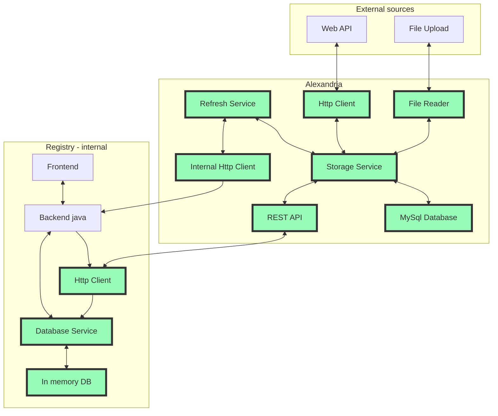

# Bachelorppgave 2023 - Forprosjekt

## Introduksjon

Helse Nord IKT er et eget foretak under Helse Nord paraplyen som i hovedsak leverer tjenester til andre foretak i Helse Nord.
Seksjon for systemutvikling i avdeling for Tjenesteutvikling er delt opp i ulike team. 

### Kvalitetsregister
Denne oppgaven er på bestilling fra team
for kvalitetsregister. Helse Nord IKT er en av to godkjente leverandører av nasjonale medisinske kvalitetsregister. Teamet jobber
med å utvikle platform for kvalitetsregister samt de spesfikke register.

Et medisinsk kvalitetsregister er en registreringsløsning for medisinske data relatert til et spesifikt fagfelt, der data samles
 inn for å brukes til forskning. Et eksempel på et slikt register er Norsk Gynekologisk Endoskopi Register(NGER). 

Registeret samler inn data om:

* Konvertering til laparoskopi (ut fra hysteroskopi)/ laparotomi (ut fra hysteroskopi, laparoskopi)
* Intraoperative komplikasjoner
* Postoperative komplikasjoner
* Reoperasjon for komplikasjoner innen 4 uker
* pasientens helsegevinst og 
* tilfredshet med behandlende enhet

[ref]https://www.kvalitetsregistre.no/register/gynekologi/norsk-gynekologisk-endoskopiregister

Ved å samle inn data fra alle pasienter som blir endoskopisk operert for gynekologiske tilstander og sykdommer ved offentlige og private
sykehus er det da mulig å utføre statistike analyser for å identifisere positive og negative aspekter ved det enkelte behandlignssted og
på tvers av behandlingssted. 

[ref]https://www.kvalitetsregistre.no/register/gynekologi/norsk-gynekologisk-endoskopiregister

På denne måten er nasjonale kvalitetsregister et viktig verktøy for å sikre lik og trygg behandling for alle pasienter uavhengig av geografisk
tilhørlighet.

### 1.1 Bakgrunn for oppgaven

For registering av medisinske kvalitetsparamtre brukes det diverse oppslagsverk. Kodeverk som brukes er [Skriv ned alle]. I tillegg kreves det
oppdatert informasjom om opplysninger som norske postnummer, kommuner, fylker osv [fyll på mer her]. Dette er i dag opplysninger som er hardkodet
inn i applikasjonen, skal de oppdateres trenger de enten en "redeploy" eller kjøring av SQL script i produksjonsmiljøet. Dette er en prosess som 
må gjentas for alle kvalitetsregistre. Det er heller ingen automatikk i oppdatering av koder, det skjer enten når utvikler oppdager utdaterte koder
eller når kunde ber om oppdaterte koder.

Det er derfor ønskelig med en felles tjeneste som kan hente inn koder fra ulike kilder(API, filer osv.) sammenfatte og versjonsstyre kodene. For
så å levere de til register applikasjonene via et REST API. Det er altså ønskelig automatisere oppdaterings prosessen i størs mulig grad, 
og på denne måten kunne tilby mest mulig oppdatert data.

Det er da også naturlig at det implementeres en klient til APIet i registrenes felles kode. Da er det naturlig å tenke at koder ikke lengre lagres
i SQL databasen, men heller i en type in-memory database for raskere oppslag i applikasjonen. In-memory databasen settes opp slik at den oppdateres hver gang det kommer nye koder i REST APIet. 

### 1.2 Prosjektbeskrivelse og analyse
Utviklingen vil foregå i to ulike kodebaser. Selve tjenesten som skal hente data fra eksterne kilder og i den eksisterende register koden der HTTP klient og in-memory database skal etableres.

**Alexandria:**
Applikasjonen vi skal utvikle har fått navnet Alexandria etter det store biblioteket i Alexandria i Egypt.
Applikasjonen vil bestå av minimum følgende komponenter:

 1. HTTP Klient som skal hente data fra eksterne kilder der det er mulig
 2. Fil leser som skal lese inn filer som inneholder data der datafangst via API ikke var mulig
 3. En lagrings service som snakker med data inn og data ut tjenestene og lagrer/henter data i en MySql database
 4. Database for lagring av innhentet data
 5. REST API som serverer data til kvalitetsregister ved forespørsel
 6. En refresh service som poller storage service for endringer. Når det er registrert sendes det en melding til
 registeret om at det kan hente ny oppdatert data til sin in-memory database
 7. HTTP Klient som sender melding til kvalitetsregisteret om mulighet for oppdatering av data

 **Eksisterende backend:**

 1. HTTP Klient som skal hente oppdaterte data fra Alexandria etter mottak om oppdaterte data
 2. Storage service som lagrer og henter data fra in-memory database
 3. In-memory database

### Dataflyt i applikasjonen
Grønne ruter skal implementeres som en den av prosjektet.

Fig 1. Dataflyt i applikasjonen

**Teknologier:**

Kvalitetsregister teamet bruker JVM teknologier for sin utvikling, da spesifikt Java og Kotlin, der hovedkodebasen
er en monolitt skrevet i Java som tar i bruk mange ulike teknologier. Ny kode skrives som regel i Kotlin. Tjenester
som er ekstern til monolitten skrives i Kotlin. Med dette tatt i betraktning skal også denne tjenesten skrives i
Kotlin. Alle nye tjenester kjører i kontainermiljø, der produksjonsmiljøet er driftet av Norsk Helse Nett(NHN). 
Hele kvalitetsregisterplatformen til HN-IKT er i en migreringsprosess der den skal over i Kubernetes. Det er derfor
viktig at applikasjonen utvikles slik at den enkelt kan kjøre i et slik miljø.

Hovedteknologier som skal brukes for tjenesten
* Kotlin
* Ktor web server og http klient rammeverk
* R2DBC for databasetilgang
* Gradle som byggverktøy
* Docker og docker-compose for kontainer kjøremiljø og oppsett
* MySql database

